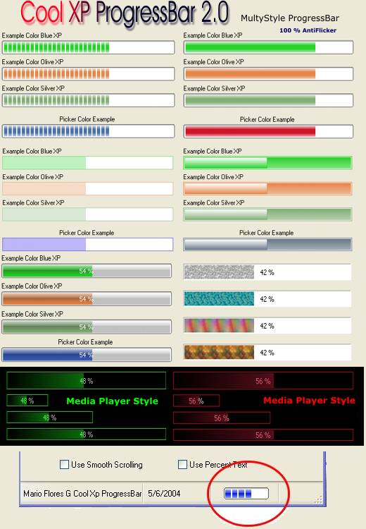



## Cool XP ProgressBar 2\.0 \(MultiStyle ProgressBar\)

### Description

The New Release of the Awesome XP Progress Bar is now available.

The new control offers more detailed painted controls, with more OS capability, now supports NT4, Also included the Media Player Progress Bar Style, and many others.

The Control itself as it predecessor does not need any dependency file and its very light in size.

Now It haves 8 Styles to choose from.

The 5 New Styles are Limited to horizontal Orientation as I don’t use vertical very often , but if you like using it just code it your self, the code is very easy to follow and very understandable .

You are free to use this code on any way you wish, on commercial apps, on freeware or any other except selling the code claiming that is yours.

Enjoy!

If you have any question, you can contact me on my e-mail

sistec_de_juarez@hotmail.com or mflores@ansell.com

Feedback is Welcome

14 September

New Style ::: "" METALLIC XP""

Added Font capability
 
### More Info
 

             |
---                |---
**Submitted On**   |2004-09-14 21:35:28
**By**             |[MArio Flores G](https://github.com/Planet-Source-Code/PSCIndex/blob/master/ByAuthor/mario-flores-g.md)
**Level**          |Intermediate
**User Rating**    |5.0 (502 globes from 101 users)
**Compatibility**  |VB 6\.0
**Category**       |[Custom Controls/ Forms/  Menus](https://github.com/Planet-Source-Code/PSCIndex/blob/master/ByCategory/custom-controls-forms-menus__1-4.md)
**World**          |[Visual Basic](https://github.com/Planet-Source-Code/PSCIndex/blob/master/ByWorld/visual-basic.md)
**Archive File**   |[Cool\_XP\_Pr1793789142004\.zip](https://github.com/Planet-Source-Code/mario-flores-g-cool-xp-progressbar-2-0-multistyle-progressbar__1-56151/archive/master.zip)

